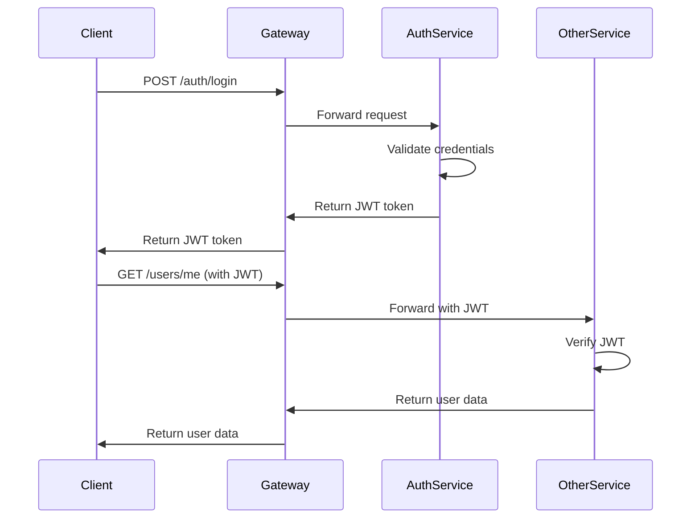

# 🏗️ Architecture Technique - Jolmood MVP

## 📋 Vue d'Ensemble

Jolmood MVP utilise une architecture microservices avec les composants suivants :

- **Gateway** : Nginx (reverse proxy et load balancer)
- **Services** : 6 microservices FastAPI indépendants
- **Bases de données** : PostgreSQL (5 instances séparées) + MongoDB avec GridFS
- **Interface d'admin** : mongo-express pour MongoDB

## 🔧 Services et Ports

| Service | Port | Responsabilité | Base de données |
|---------|------|----------------|-----------------|
| **nginx-gateway** | `8080` | Routage, load balancing, CORS | - |
| **auth-service** | `5001` | Authentification, JWT, sessions | `auth_db` (PostgreSQL) |
| **user-service** | `5002` | Profils utilisateurs, coachs | `user_db` (PostgreSQL) |
| **post-service** | `5003` | Posts, likes, commentaires | `post_db` (PostgreSQL) |
| **appointment-service** | `5004` | Rendez-vous, planning | `appointment_db` (PostgreSQL) |
| **admin-service** | `5005` | Administration, stats, logs | `admin_db` (PostgreSQL) |
| **media-service** | `GridFS` | Upload/download de fichiers | `jolmood_media` (MongoDB) |
| **mongo-express** | `8081` | Interface web pour MongoDB | - |

## 🌐 Routage Nginx

Le gateway Nginx (`localhost:8080`) route les requêtes vers les services appropriés :

```nginx
# Authentification
/auth/* → http://auth-service:5001/*

# Utilisateurs
/users/* → http://user-service:5002/*

# Posts sociaux
/posts/* → http://post-service:5003/*

# Rendez-vous
/appointments/* → http://appointment-service:5004/*

# Administration
/admin/* → http://admin-service:5005/*

# Médias (privés, JWT requis)
/media/* → http://media-service:8000/*

# Médias publics (sans JWT)
/media/public/* → http://media-service:8000/public/*
```

## 🗄️ Architecture des Bases de Données

### PostgreSQL (5 instances séparées)

Chaque service a sa propre base de données pour respecter le principe de séparation des données :

```
┌─────────────────┐    ┌─────────────────┐    ┌─────────────────┐
│   auth_db       │    │   user_db       │    │   post_db       │
│  Port: 5432     │    │  Port: 5433     │    │  Port: 5434     │
│                 │    │                 │    │                 │
│ • users         │    │ • user_profiles │    │ • posts         │
│ • sessions      │    │ • coach_profiles│    │ • likes         │
│ • refresh_tokens│    │ • specialties   │    │ • comments      │
└─────────────────┘    └─────────────────┘    └─────────────────┘

┌─────────────────┐    ┌─────────────────┐
│ appointment_db  │    │   admin_db      │
│  Port: 5435     │    │  Port: 5436     │
│                 │    │                 │
│ • appointments  │    │ • admin_logs    │
│ • availability  │    │ • system_stats  │
│ • bookings      │    │ • audit_trail   │
└─────────────────┘    └─────────────────┘
```

### MongoDB + GridFS

```
┌─────────────────────────────────┐
│         MongoDB                 │
│        Port: 27017              │
│                                 │
│  Database: jolmood_media        │
│                                 │
│  Collections:                   │
│  • fs.files (métadonnées)      │
│  • fs.chunks (données binaires) │
│                                 │
│  GridFS pour:                   │
│  • Images de profil             │
│  • Photos de posts              │
│  • Documents                    │
│  • Vidéos (futures)             │
└─────────────────────────────────┘
```

## 🔐 Sécurité

### Authentification JWT



### Gestion des Rôles

| Rôle | Permissions |
|------|-------------|
| **user** | Consulter posts, prendre RDV, gérer son profil |
| **coach** | Permissions user + gérer planning, voir RDV clients |
| **admin** | Toutes permissions + stats système, gestion utilisateurs |

### Sécurité des Médias

- **Endpoint privé** (`/media/{id}`) : JWT obligatoire
- **Endpoint public** (`/media/public/{id}`) : Accessible sans authentification
- **Limites d'upload** : 10MB max par fichier
- **Types autorisés** : images (jpg, png, gif), documents (pdf)

## 🔄 Communication Inter-Services

### Actuelle : REST Synchrone

```
Client → Gateway → Service A → Service B (HTTP)
```

### Future : Events Asynchrones

```
Service A → Message Queue → Service B
          → Event Store
```

**Technologies envisagées :**
- Redis/RabbitMQ pour les queues
- Event sourcing pour l'audit
- CQRS pour la séparation lecture/écriture

## 🚦 Monitoring et Santé

### Health Checks

Chaque service expose un endpoint `/health` :

```json
{
  "status": "healthy",
  "service": "auth-service",
  "version": "1.0.0",
  "database": "connected",
  "timestamp": "2025-01-08T10:30:00Z"
}
```

### Logs Centralisés

- **Format** : JSON structuré
- **Niveaux** : DEBUG, INFO, WARNING, ERROR, CRITICAL
- **Rotation** : Quotidienne avec rétention 30 jours
- **Agrégation** : Via admin-service

## 🔧 Configuration

### Variables d'Environnement

Chaque service utilise des variables d'environnement pour :
- Connexions base de données
- Secrets JWT
- Configuration CORS
- Limites et timeouts

### Docker Compose

- **Réseaux isolés** : Services groupés par fonction
- **Volumes persistants** : Données PostgreSQL et MongoDB
- **Health checks** : Vérification automatique des services
- **Restart policies** : Redémarrage automatique en cas d'erreur

## 📈 Évolutivité

### Horizontale

- Load balancing Nginx
- Réplication PostgreSQL (read replicas)
- Sharding MongoDB
- Cache Redis (sessions, requêtes fréquentes)

### Verticale

- Optimisation des requêtes SQL
- Indexation appropriée
- Connection pooling
- Compression des réponses

## 🔮 Roadmap Technique

### Phase 2 : Optimisations
- [ ] Cache Redis
- [ ] CDN pour les médias publics
- [ ] Compression d'images automatique
- [ ] Rate limiting par utilisateur

### Phase 3 : Scalabilité
- [ ] Kubernetes deployment
- [ ] Message queues (RabbitMQ/Redis)
- [ ] Event sourcing
- [ ] Monitoring avancé (Prometheus/Grafana)

### Phase 4 : Fonctionnalités
- [ ] Notifications push
- [ ] Vidéo-conférence intégrée
- [ ] IA pour recommandations
- [ ] Analytics avancées

## 🛠️ Outils de Développement

- **Orchestration** : Docker Compose
- **Documentation API** : FastAPI Swagger (auto-générée)
- **Tests API** : Postman + collections automatisées
- **Base de données** : DBeaver pour PostgreSQL, mongo-express pour MongoDB
- **Monitoring** : Docker logs, health checks

---

Cette architecture permet une séparation claire des responsabilités, une scalabilité future, et une maintenance simplifiée de chaque composant.
